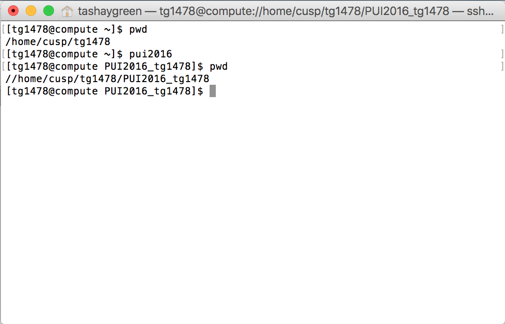

# PUI 2016 HW 1.  

# Assignment 1: Finish Lab 1

For this assignment I worked with Ben Miller (bsmiller25). First, I forked Ben's repo "githubtest_bm2393," then cloned the fork onto my computer. I modified Ben's file "myfirstfile.txt," then submitted a pull request to add the changes to his original file. 

Ben later merged the pull request and committed my changes to his original file. Ben also performed the same actions on my repository "gittest_tg1478."


## Assignment 2: Set up your environment: 

1. I created a directory on compute called PUI2016_tg1478.
2. I created an environmental variable on compute called PUI2016, that returns the full path to the directory PUI2016_tg1478.

	If I run the command 
	```
	echo $PUI2016
	```
	the full path to the directory is returned. 

3. I created an alias so that typing the following command takes me to the PUI2016_tg1478 diretory. 
 	```
	pui2016 
	```
4. Screenshot of my .bashrc


5. After typing this series of commands on the terminal:
	```
	pwd
	pui2016
	pwd
	```
	I am successfully navigated back to the PUI2016_tg1478 directory. 



6. Github repo PUI2016_tg1478 has been created. 

7. The directory, HW1_tg1478 has been created inside the PUI2016_tg1478 repo, on my local computer and Github, which contains the README.md file desciribing HW1. 
