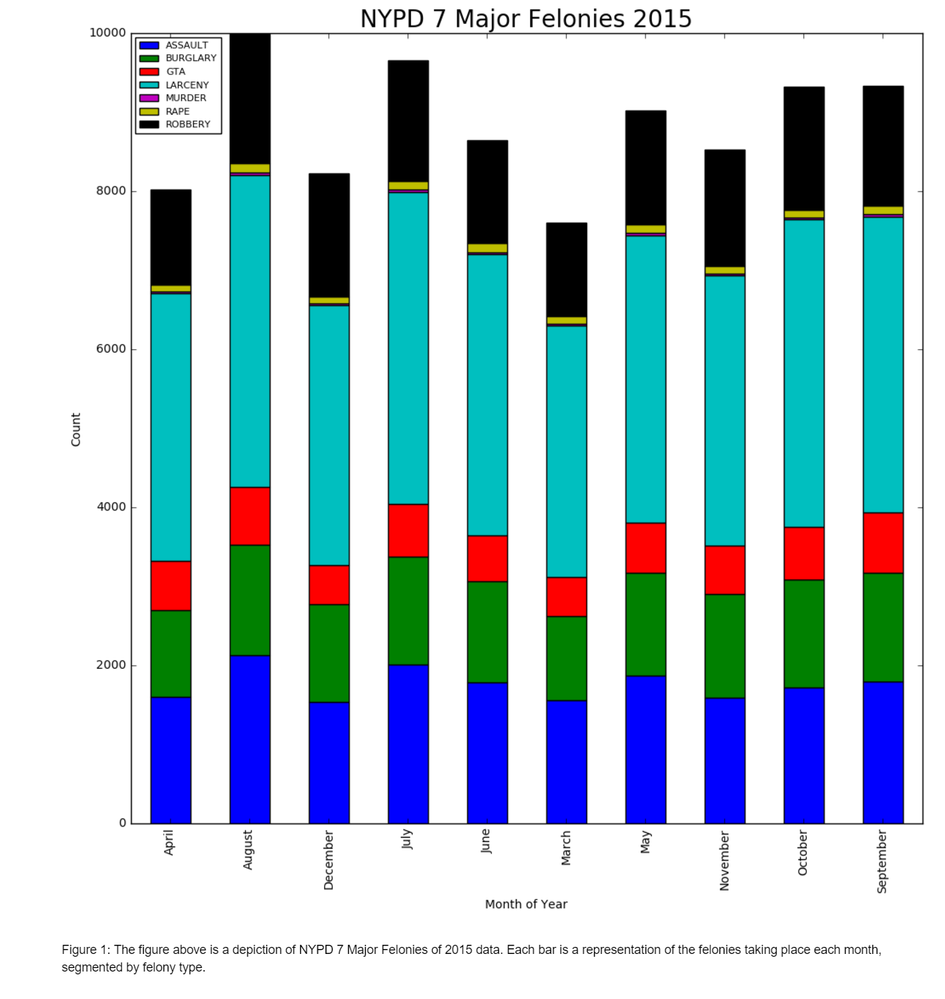

# Ben's Review of Tashay's Plot

Tashay's plot (above) shows the frequency of occurences of the seven major felonies in NYC in 2015. The plot is not very clear. First of all, the original plot is too big. I could not view the entire plot without zooming out. Second, the months are in alphabetical order instead of chronological order which removes any possible time understanding. There are also only 10 months displayed with no explanation for the missing January and February. 

Additionally, the esthetics of the plot should be improved. The red and green on the same plot could cause issues for color blind viewers. The stacked bars, especially out of chrnological order, make it difficult to draw any conclusions from this data. The murder bar is barely visible and it is difficult to compare any catergory across months. 

Suggestions for improvement:
- Shrink the plot to be visible on the screen
- Put the bars in calendar order and have each bar
- Choose a more color-blindness aware color scheme