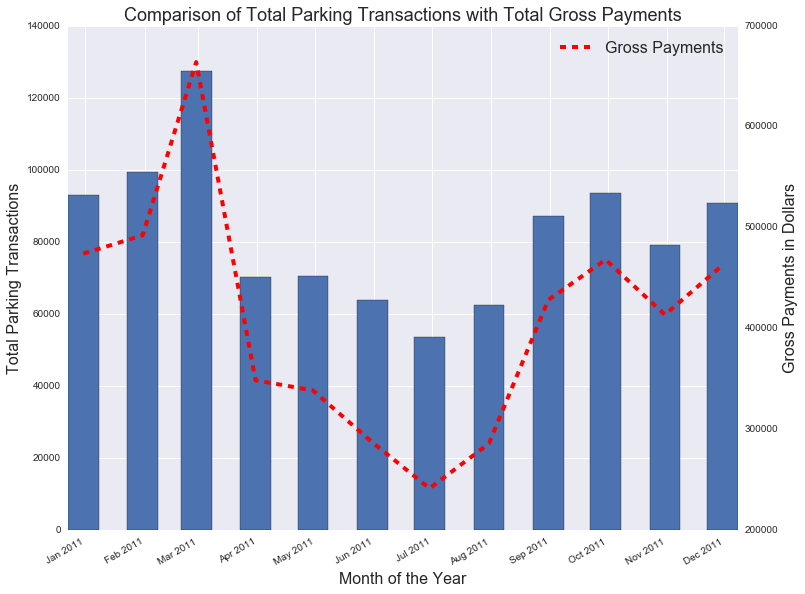

# HW7 Plot Review (jp4772)
By: Tashay Green 

## The Plot

Figure 1: Bar plot of monthly total parking transactions with comparison line showing gross payments per month.

**CLARITY**: The plot is very clean and easy to read. The grid in the background is helpful for following the bar values and the dashed trend line is insightful.

**AESTHETIC**: The elements, colors, and graphical choices are appropriate for the data/plot.

**HONESTY**: The plot is true to the data and represents it in an honest form. 

**SUGGESTIONS**: 
- If possible, make label text a little larger.
- For the y-axis labels consider using smaller values to represent large quanties (ex. Total Parking Transactions (in thousands) --> 20, 40, 60, etc.), this will take away some of the clutter and allow for larger text on the axes. 
